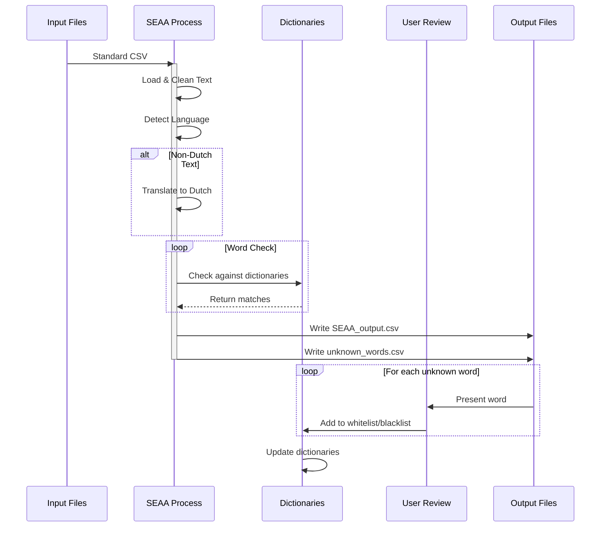

# SEAA: Semi-automatic Anonymization Algorithm
A Python tool for detecting and anonymizing privacy-sensitive information in open-ended Dutch survey responses or other open answers.

## Overview
SEAA helps identify and anonymize potentially privacy-sensitive information in text responses, particularly useful for processing survey data. Any csv file with open answers can be processed. It uses dictionary-based matching that is updated by user interaction to:
- Detect unknown words that might contain private information
- Flag known privacy-sensitive terms (names, medical conditions, etc.)
- Replace sensitive information with category markers (e.g., [NAME], [ILLNESS])
- Allow users to expand the whitelist/blacklist of words through interactive review
- User input is expanded in the dictionaries and used for future analyses

> NOTE: this tool is primarily designed for Dutch text, but includes translation capabilities for non-Dutch responses.

##  Flow chart

##  Flow chart


## Prerequisites

Before installing SEAA, ensure you have:
1. Python 3.7 or higher installed
2. Git installed
3. Basic understanding of command line operations
4. A modern web browser (Chrome, Firefox, Safari, or Edge)

## Installation

1. Clone the repository and switch to the AL_local_flask branch:
```bash
git clone https://github.com/uashogeschoolutrecht/SEAA.git
cd SEAA
git checkout AL_local_flask
```

> **Important**: The web interface is only available on the `AL_local_flask` branch. Make sure you switch to this branch before proceeding.

2. Install required dependencies:
```bash
pip install -r requirements.txt
```

## Running the Application

SEAA provides a web interface for processing and anonymizing your data. There are two ways to run the application:

### Using Flask Development Server
1. Open a terminal in the project directory
2. Run the Flask application:
```bash
python app.py
```
3. Open your web browser and navigate to:
```
http://localhost:5000
```


> **Note**: The development server is not suitable for production use. 

Once the application is running, you can:
1. Access the main interface at `http://localhost:5000` for file processing
2. View the documentation at `Documentation`
3. Upload your CSV files through the web interface
4. Process and download anonymized results
5. Help improve the dictionaries through the interactive review process (optional)

## Input Requirements

Your input CSV file must:
- Use semicolon as the separator
- Contain these columns in order: 
  1. `respondent_id` - Unique identifier for each respondent
  2. `Answer` - The text responses to analyze
  3. `question_id` - Identifier for the question being answered

Example input CSV format:
```csv
respondent_id;Answer;question_id
1001;"Mijn docent Peter heeft mij enorm geholpen";Q1
1002;"Ik had moeite met concentratie tijdens de lessen";Q1
```

## Output Files

The tool generates several output files:

1. `SEAA_output.csv`: Main analysis results containing:
   - Original text
   - Censored text
   - Privacy flags
   - Detected sensitive words

2. `avg_words_count.csv`: List of unknown words for review

3. Updated dictionary files in `dict/` folder:
   - `whitelist.txt`: Safe words
   - `blacklist.txt`: Privacy-sensitive words

## Output File Columns

The `SEAA_output.csv` contains the following columns:

- `respondent_id`: Original respondent identifier
- `Answer`: Original text response
- `question_id`: Original question identifier
- `answer_clean`: Cleaned version of the text (lowercase, normalized)
- `contains_privacy`: Binary flag (1/0) indicating if privacy-sensitive content was detected
- `unknown_words`: List of words not found in the dictionary or whitelist
- `flagged_words`: List of words matched against the privacy-sensitive dictionaries
- `answer_censored`: Text with privacy-sensitive words replaced by category markers (e.g., [NAME], [ILLNESS]) and unknown words replaced by [UNKOWN]
- `total_word_count`: Total number of words in the response
- `unknown_word_count`: Number of words not found in dictionaries (still need to be reviewed)
- `flagged_word_count`: Number of privacy-sensitive words detected
- `unknown_words_not_flagged`: Unknown words that are not in the dictionaries
- `flagged_word_type`: Categories of privacy-sensitive content found (e.g., "name, illness")
- `language`: Detected language of the response (e.g., 'nl' for Dutch, 'en' for English)

Example row:
```csv
respondent_id;Answer;question_id;answer_clean;contains_privacy;unknown_words;flagged_words;answer_censored;total_word_count;unknown_word_count;flagged_word_count;unknown_words_not_flagged;flagged_word_type;language
1;"Mijn docent Peter heeft mij geholpen met mijn loopbaanbegleidingstraject";"Q1";"mijn docent peter heeft mij geholpen met mijn loopbaanbegleidingstraject";1;"";peter;"Mijn docent [NAME] heeft mij geholpen met mijn [UNKOWN]";10;0;1;;"name";"nl"
```

## Interactive Word Review

The tool will present unknown words for review, allowing you to:
- Add words to the whitelist (safe words)
- Add words to the blacklist (privacy-sensitive words)
- Skip words for later review

Example interaction:
```
"docent" kwam 45 keer voor in de open antwoorden.
Wil je dit woord toevoegenaan de whitelist? (j/n/blacklist): j
Woord "docent" is toegevoegd aan de whitelist

"janssen" kwam 12 keer voor in de open antwoorden.
Wil je dit woord toevoegenaan de whitelist? (j/n/blacklist): blacklist
Woord "janssen" is toegevoegd aan de blacklist
```

## Dictionary Management

The tool uses several dictionary files in the `dict/` folder:
- `wordlist.txt`: Base dictionary of common words
- `whitelist.txt`: User-approved safe words
- `blacklist.txt`: Known privacy-sensitive words
- `illness.txt`: Medical conditions and health-related terms
- `studiebeperking.txt`: Study limitations
- `names.txt`: Common first names plus some last names
- `familie.txt`: Family relationship terms

## Language Detection and Translation

The tool automatically detects the language of responses. For non-Dutch text, it uses a translation service to convert the text to Dutch before processing. This allows SEAA to handle multilingual datasets while maintaining consistent anonymization rules.

The translation system:
- Detects the source language using language detection
- Translates non-Dutch text to Dutch using multiple translation services
- Falls back to alternative translators if one fails
- Handles large texts by breaking them into manageable chunks

## Limitations

- Dictionary-based approach may miss complex or context-dependent privacy information
- Translation quality may affect anonymization accuracy for non-Dutch responses
- Regular maintenance of dictionaries is recommended for optimal performance

