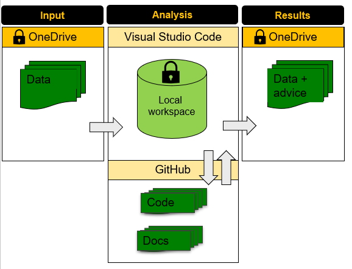

# SEAA

Semi-automatic anonimisation (SEAA) algorithm of the HU University of Applied Sciences Utrecht.

## Summary
Open answers (an answer given to an open question) can contain privacy-related data. Currently, the most used methods of anonimisation at the HU is to do this by hand, to use non-anonimised data, or simple not use the data at all. The SEAA algorithm uses privacy-by-design as a fundamental principle: always make sure your data does not contain any privacy-related information. Using SEAA on your open answer data you can quickly identify which answers might contain privacy-related data and which answer do not. The answers that SEAA flags as 'might contain privacy-related data' can then be manually reviewed.  

## How does SEAA work?

The algorithm uses both dictionairies and smart rules to determine if input (an answer to an open question) contains privacy-related data. SEAA will check for each answer if the words it contains are 'unknown' words (i.e. not part of the Dutch standard dictionary) as well as 'flagged' words (i.e. checking several blacklists for specific words related to privacy). An answer will be flagged as soon as it contains any unknown words and/or flagged words. 

The algorithm gives an advice in the form of 'Yes/No' whether the input contains privacy-related data. SEAA uses the 'privacy-by-default' rule: if the algorithm is not sure if an answer contains privacy-related information, it will always give back 'Yes'. Only when SEAA is 100% sure the input does not contain any privacy-related data, a 'No' will be adviced.

## Dictionaries

SEAA uses a number different dictionaries, to determine unknown words as well as flagged words. The following dictionaries are combined and used to determine known words:

- Dutch language word list of [OpenTaal](https://www.opentaal.org/), the publiced wordlists 'basiswoorden-gekeurd' and 'flexies-ongekeurd' on their [GitHub](https://github.com/OpenTaal/opentaal-wordlist)
- HU Whitelist. Assembled by the project team with input from the stakeholders. 

Any words of an open answer that are not part of above dictionaries are flagged by SEAA as 'unknown' words. 

In addition, any words (known or unknown) that are part of the following dictionaries are flagged by SEAA as sensitive words:

- Dutch illness list ([Wikipedia](https://nl.wikipedia.org/wiki/Lijst_van_aandoeningen))
- Dutch first name list ([Nederlandse Voornamenbank](https://nvb.meertens.knaw.nl/veelgesteldevragen))
- Study limitations. Assembled by the project team with input from the stakeholders. 
- Blacklist. Assembled by the project team with input from the stakeholders. 

Dictionaries are currently static, but will be added upon by stakeholders. 

## How can I use SEAA?
It is important to note that SEAA is only a tool and further work is needed on the data. When SEAA has given advice on your data, you are advised to use the 'contains_privacy' column that was added by SEAA to filter out all open answer that possibly contain privacy-related data. Only when this data is filtered, the remaining data is effectively anonimized and can be stored in another (more accessible) location and/or distributed (e.g. in a report). Furthermore, we strongly advise to use anonimised data as much as possible instead of unanonimsed data. Unanonimised data should only be used by a small number of people, and only when strictly necessary. 

We do advice when sharing data anonimised by SEAA to always include a disclaimer that reads the following: "Deze data is geanonimiseerd. Zie je toch nog privacy-gerelateerde informatie? Neem dan contact op met ...', in which a contact number and/or emailaddress is added. 

In addition, any possible flaws in the SEAA algorithm can be flagged here in the GitHub repo as an issue. 

## Privacy & security
SEAA uses the privacy-by-design principle by always flagging an answer unless it only contains words that are deemed 'safe'. Words that are considered 'safe' are words part of the regular Dutch dictionary. In addition, an answer was also flagged as soon as it contains at least one word part of a sensitive word dictionary. For example, the answer 'Ik ben een docent' will not be flagged since it only contains 'safe' words, i.e. words part of the Dutch dictionary, and it contains no sensitive words. In contrast, the answer 'Ik heb een depressie' will be flagged. This answer contains only 'safe' words, i.e. words part of the Dutch dictionary, however, it also contains the sensitive word 'depressie' and therefor will be flagged (privacy first). 

### Privacy definitions
A strict privacy definition was needed to determine when an answer was considered to contain privacy-related data. Find below the privacy definitions we used to assess answers. 

In general SEAA follows the Dutch implementation of the GDPR as provided by the [Autoriteit Persoonsgegevens](https://www.autoriteitpersoonsgegevens.nl/) (i.e. the [Dutch Data Protection Authority](https://www.autoriteitpersoonsgegevens.nl/en/about-the-dutch-dpa/tasks-and-powers-of-the-dutch-dpa)). Since SEAA is an algorithm, a set of specified rules about when exactly privacy-concerns arise are needed. The enforcement of GDPR on data, however, is not specified in detail so a specific set of rules was defined based on the GDPR.
A word and/or sequence of words is defined as “possibly containing privacy-related information” when one of the following:

- Contains information directly relatable to a person. That is:
  - First name, last name
  - Email address
  - IP address
  - Address
  - Phone number
  - Student number
  - BSN number
  - Date of birth
- Contains any mention of illness(type).

### Security
SEAA is an algorithm that handles data that might contain privacy-related information, thus storing and handling this type of sensitive data is paramount. SEAA, as used by Team Data & Analytics of the HU, uses the following data architecture to ensure data safety:

1. Data to enter SEAA (input) is stored in a secure OneDrive folder with only limited access. Only employees with explicit permissions are allowed to enter this data folder. 
2. SEAA is run in a local Python workspace in Visual Studio Code in which security is ensured through Windows security. This workspace concurrently uses data from the input folder (step 1) as well as code and/or docs present on the GitHub respository (https://github.com/uashogeschoolutrecht/SEAA). Please note that data or any other privacy-related information is never stored on GitHub, and this is enforced by explicit rules excluding data from uploading to GitHub. 
3. Results from SEAA are added back into the original data file, such that the same security from step 1 applies. 

Data in the secure OneDrive folder is only stored for the duration of the analysis. 

## Validation
SEAA was developed as a pilot to be ran on the open answer data of the National Student Questionaire (NSE) as requested by Hans Kruijer. During this phase (which ran from Sep '23 - Feb '24) the following stakeholders were involved:

- Team Institutional Research (product owner: Hans Kruijer)
- Team Data & Analytics
- Leonie Redder (opdrachtgever)
- Dick Vestdijk (privacy manager OO&S)

During this pilot we developed SEAA to work as we intended and we tested this as following: SEAA was validated using open answer data of the National Student Questionaire (NSE) of 2023. In total a number of 2239 open answers were annotated by hand, i.e. manually indicating whether an answer contains privacy-related data. Annotations include a random draw from all NSE questions, as well as all answers from the question regarding study limitations and illness. 

### Pilot results
#### Accuracy
Out of 2239 cases there were 11 cases where SEAA did not flag the answer even though it was annotated as containing privacy-related data. Examining these false negative cases in more depth showed that 10 out of 11 answers where falsely annotated as containing privacy-related data. One false negative case contained a reference to a car-accident ('auto-ongeluk').

In conclusion, SEAA reached a very high accuracy of 99% while flagging answers from the National Student Questionaire (NSE) 2023. 

#### Efficiency
Out of 2239 annotated cases, SEAA classified 1777 cases as not containing any privacy-related data, indicating an efficiency of 79%. In effect, using SEAA on this specific dataset would decrease the manual workload with 79%.  

## After the pilot
SEAA was further evaluated for organizational adoption by privacy officer Lisanne Reurings (Dienst Finance, Control & Analytics) and privacy manager Rinske Plomp. 

