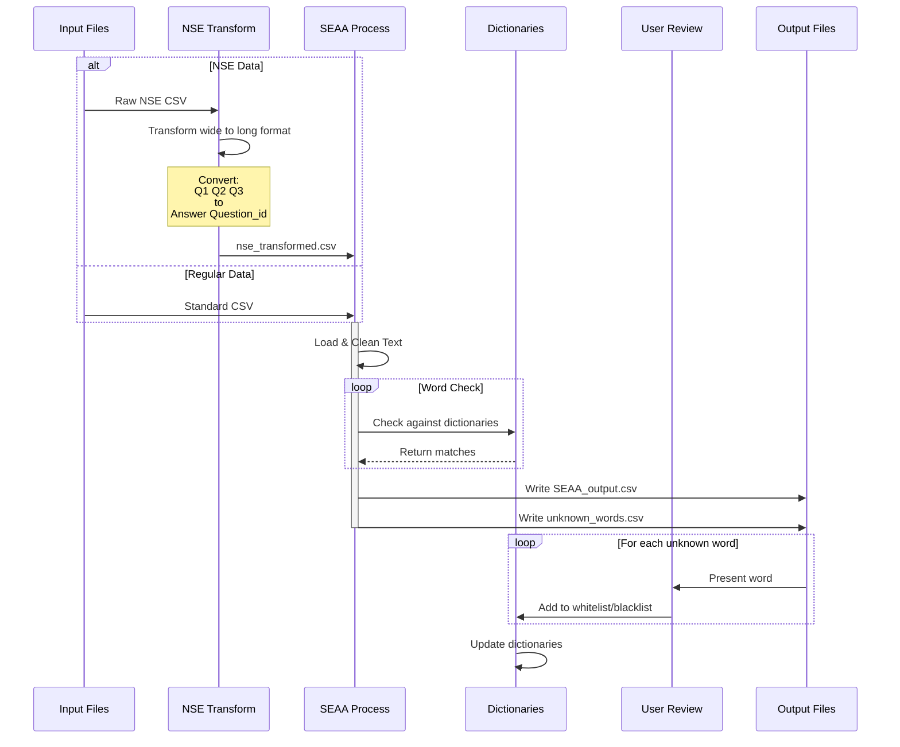

# SEAA: Semi-automatic Anonymization Algorithm
A Python tool for detecting and anonymizing privacy-sensitive information in open-ended dutch survey responses or other open anwnsers.

## Overview
SEAA helps identify and anonymize potentially privacy-sensitive information in text responses, particularly useful for processing survey data. Any csv file with open answers can be processed. It uses dictionary-based matching that is updated by user interaction to:
- Detect unknown words that might contain private information
- Flag known privacy-sensitive terms (names, medical conditions, etc.)
- Replace sensitive information with category markers (e.g., [NAME], [ILLNESS])
- Allow users to expand the whitelist/blacklist of words through interactive review
- User input is expanded in the dictionaries and used for future analyses
- Originally developed for the National Student Survey (NSE) data but expaned to other csv files with open answers.

> NOTE: this tool can only be used for Dutch text.


##  Flow chart


## Installation

1. Clone the repository:

```bash
git clone https://github.com/uashogeschoolutrecht/SEAA.git
cd seaa
```

2. Install required dependencies:

```bash
pip install -r requirements.txt
```

## Input Requirements

Your input CSV file must:
- Use semicolon as the separator
- Contain these columns in order: 
  1. `respondent_id` - Unique identifier for each respondent
  2. `Answer` - The text responses to analyze
  3. `question_id` - Identifier for the question being answered

Example input CSV format:
```csv
respondent_id;Answer;question_id
1001;"Mijn docent Peter heeft mij enorm geholpen";Q1
1002;"Ik had moeite met concentratie tijdens de lessen";Q1
```

## Basic Usage

1. Place your input CSV file in your working directory
2. Update the path and filename in your script:

```python
# Set your file path and name
path = r'C:\Your\Path\Here'
input_file = 'your_input_file.csv'

# Run the main function
main(path, input_file=input_file)
```

### For NSE (National Student Survey) Data
If you're processing NSE data, use:

```python
path = r'C:\Your\Path\Here'
transform_nse = "nse2023.csv"  # Your NSE file
input_file = None

main(path, transform_nse=transform_nse, input_file=input_file)
```

## Output Files

The tool generates several output files:

1. `SEAA_output.csv`: Main analysis results containing:
   - Original text
   - Censored text
   - Privacy flags
   - Detected sensitive words

2. `avg_words_count.csv`: List of unknown words for review

3. Updated dictionary files in `dict/` folder:
   - `whitelist.txt`: Safe words
   - `blacklist.txt`: Privacy-sensitive words

## Interactive Word Review

The tool will present unknown words for review, allowing you to:
- Add words to the whitelist (safe words)
- Add words to the blacklist (privacy-sensitive words)
- Skip words for later review

Example interaction:
```
"docent" kwam 45 keer voor in de open antwoorden.
Wil je dit woord toevoegenaan de whitelist? (j/n/blacklist): j
Woord "docent" is toegevoegd aan de whitelist

"janssen" kwam 12 keer voor in de open antwoorden.
Wil je dit woord toevoegenaan de whitelist? (j/n/blacklist): blacklist
Woord "janssen" is toegevoegd aan de blacklist
```

## Dictionary Management

The tool uses several dictionary files in the `dict/` folder:
- `wordlist.txt`: Base dictionary of common words
- `whitelist.txt`: User-approved safe words
- `blacklist.txt`: Known privacy-sensitive words
- `illness.txt`: Medical conditions
- `studiebeperking.txt`: Study limitations
- `names.txt`: Common first names plus some last names

## Language Detection

The tool automatically detects the language of responses and processes Dutch text. Non-Dutch responses are flagged in the output.

## Limitations

- The tool is optimized for Dutch language text
- Dictionary-based approach may miss complex or context-dependent privacy information
- Regular maintenance of dictionaries is recommended for optimal performance

