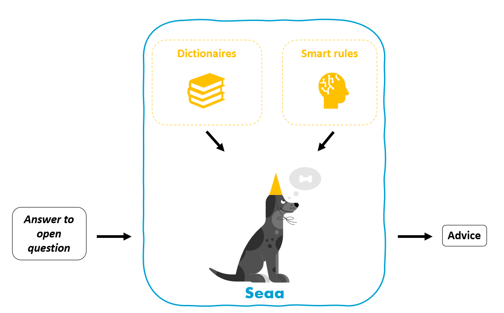

# SEAA

Semi-automatic anonimisation (SEAA) algorithm of the HU University of Applied Sciences Utrecht.

## Summary
Open answers (an answer given to an open question) can contain privacy-related data. Currently, the most used method of anonimisation at the HU is to do this by hand, or to simply not anonimise. The SEAA algorithm uses privacy-by-design as a fundamental principle: always make sure your data does not contain any privacy-related information. Using SEAA on your open answer data you can quickly identify which answers might contain privacy-related data and which answer do not. The answers that SEAA flags as 'might contain privacy-related data' can then be manually reviewed.  

## How does SEAA work?

The algorithm uses both dictionairies and smart rules to determine if input (an answer to an open question) contains privacy-related data. SEAA will check for each answer if the words it contains are 'unknown' words (i.e. not part of the Dutch standard dictionary) as well as 'flagged' words (i.e. checking several blacklists for specific words related to privacy). An answer will be flagged as soon as it contains any unknown words and/or flagged words. 

The algorithm gives an advice in the form of 'Yes/No' whether the input contains privacy-related data. SEAA uses the 'privacy-by-default' rule: if the algorithm is not sure if an answer contains privacy-related information, it will always give back 'Yes'. Only when SEAA is 100% sure the input does not contain any privacy-related data, a 'No' will be adviced.

### Censoring
Currently we have implemented a censoring functionality that will mask any blacklist words by replacing them with 'XXX'. This will increase the number of answers that do not contain any privacy-related data. 

## Dictionaries

SEAA uses a number different dictionaries, to determine unknown words as well as flagged words. The following dictionaries are combined and used to determine known words:

- Dutch language word list of [OpenTaal](https://www.opentaal.org/), the publiced wordlists 'basiswoorden-gekeurd' and 'flexies-ongekeurd' on their [GitHub](https://github.com/OpenTaal/opentaal-wordlist)
- HU Whitelist. Assembled by the project team with input from the stakeholders. 

Any words of an open answer that are not part of above dictionaries are flagged by SEAA as 'unknown' words. 

In addition, any words (known or unknown) that are part of the following dictionaries are flagged by SEAA as sensitive words:

- Dutch illness list ([Wikipedia](https://nl.wikipedia.org/wiki/Lijst_van_aandoeningen))
- Dutch first name list ([Nederlandse Voornamenbank](https://nvb.meertens.knaw.nl/veelgesteldevragen))
- Study limitations. Assembled by the project team with input from the stakeholders. 
- Blacklist. Assembled by the project team with input from the stakeholders. 

## Validation

SEAA was validated using open answer data of the National Student Questionaire (NSE) 2023. In total a number of 2239 open answers were annotated by hand. Annotations include a random draw from all NSE questions, as well as all answers from the question regarding study limitations and illness. 

For annotation, a strict privacy definition was needed to determine when an answer was considered to contain privacy-related data. Find below the privacy definitions we used to assess answers. 

### Privacy definitions

In general SEAA follows the Dutch implementation of the GDPR as provided by the [Autoriteit Persoonsgegevens](https://www.autoriteitpersoonsgegevens.nl/) (i.e. the [Dutch Data Protection Authority](https://www.autoriteitpersoonsgegevens.nl/en/about-the-dutch-dpa/tasks-and-powers-of-the-dutch-dpa)). Since SEAA is an algorithm, a set of specified rules about when exactly privacy-concerns arise are needed. The enforcement of GDPR on data, however, is not specified in detail so a specific set of rules was defined based on the GDPR.
A word and/or sequence of words is defined as “possibly containing privacy-related information” when one of the following:

- Contains information directly relatable to a person. That is:
  - First name, last name
  - Email address
  - IP address
  - Address
  - Phone number
  - Student number
  - BSN number
- Contains any mention of illness(type).

### Results
#### Accuracy
Out of 2239 cases there were 11 cases where SEAA did not flag the answer even though it was annotated as containing privacy-related data. Examining these false negative cases in more depth showed that 10 out of 11 answers where falsely annotated as containing privacy-related data. One false negative case contained a reference to a car-accident ('auto-ongeluk').

In conclusion, SEAA reached a very high accuracy of 99% while flagging answers from the National Student Questionaire (NSE) 2023. 

#### Efficiency
Out of 2239 annotated cases, SEAA classified 1777 cases as not containing any privacy-related data, indicating an efficiency of 79%. In effect, using SEAA on this specific dataset would decrease the manual workload with 79%.  

## Background
SEAA was developed as a pilot to be ran on the open answer data of the National Student Questionaire (NSE) as requested by Hans Kruijer. During this phase (which ran from Sep '23 - Feb '24) the following stakeholders were involved:

- Team Institutional Research (product owner: Hans Kruijer)
- Team Data & Analytics
- Leonie Redder (opdrachtgever)
- Dick Vestdijk (privacy manager OO&S)
