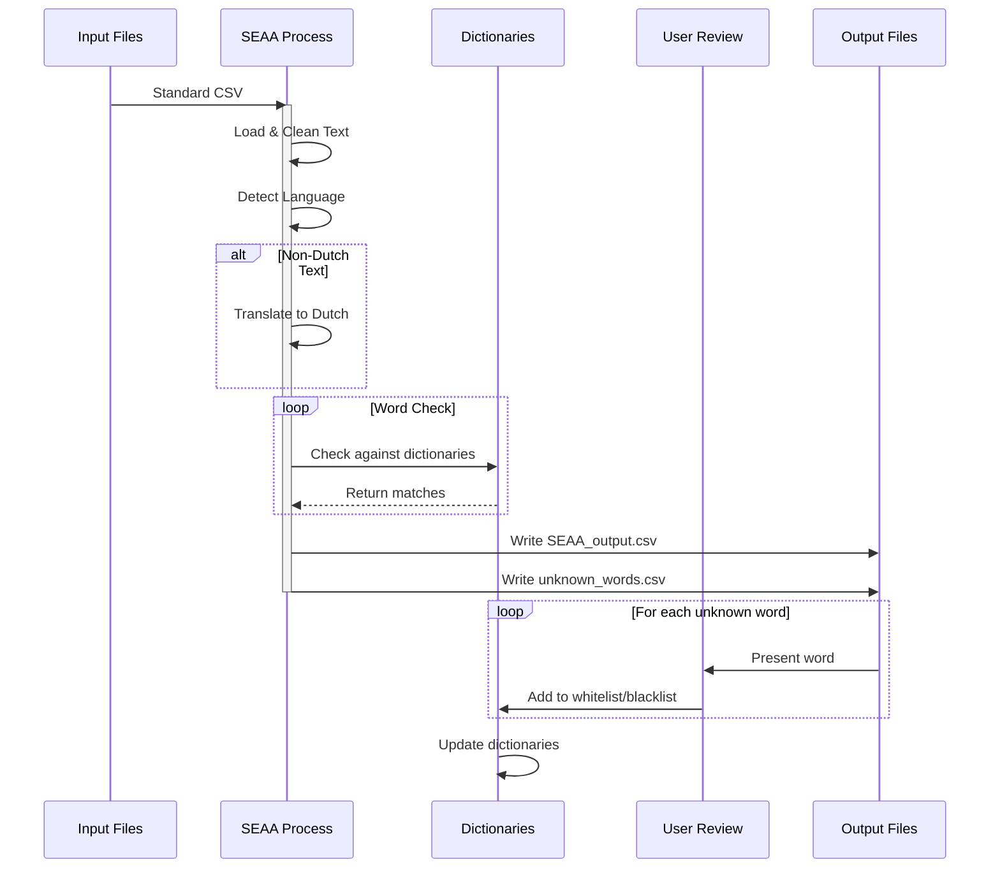

# SEAA: Semi-automatic Anonymization Algorithm
A Python tool for detecting and anonymizing privacy-sensitive information in open-ended Dutch survey responses or other open answers.

## Overview
SEAA helps identify and anonymize potentially privacy-sensitive information in text responses, particularly useful for processing survey data. Any csv file with open answers can be processed. It uses dictionary-based matching that is updated by user interaction to:
- Detect unknown words that might contain private information
- Flag known privacy-sensitive terms (names, medical conditions, etc.)
- Replace sensitive information with category markers (e.g., [NAME], [ILLNESS])
- Allow users to expand the whitelist/blacklist of words through interactive review
- User input is expanded in the dictionaries and used for future analyses

> NOTE: this tool is primarily designed for Dutch text, but includes translation capabilities for non-Dutch responses.

`Disclaimer: SEAA is a tool for anonimisation of text data, but does not replace a manual check of results nor can SEAA or it's creators be held responsible for misdetection of privacy-related data.`

##  Flow chart

##  Flow chart

```mermaid
%%{init: {'sequence': {'theme': 'hand'}}}%%
sequenceDiagram
    participant Input as Input Files
    participant SEAA as SEAA Process
    participant Dict as Dictionaries
    participant User as User Review
    participant Out as Output Files
    Input->>SEAA: Standard CSV
    activate SEAA
    SEAA->>SEAA: Load & Clean Text
    SEAA->>SEAA: Detect Language
    alt Non-Dutch Text
    SEAA->>SEAA: Translate to Dutch
    end
    loop Word Check
    SEAA->>Dict: Check against dictionaries
    Dict-->>SEAA: Return matches
    end
    SEAA->>Out: Write SEAA_output.csv
    SEAA->>Out: Write unknown_words.csv
    deactivate SEAA
    loop For each unknown word
    Out->>User: Present word
    User->>Dict: Add to whitelist/blacklist
    end
    
    Dict->>Dict: Update dictionaries
```

## Prerequisites

Before installing SEAA, ensure you have:
1. Python 3.9 or higher installed
2. Git installed

## Installation

1. Clone the repository:
```bash
git clone https://github.com/uashogeschoolutrecht/SEAA.git
cd SEAA
```

2. Install required dependencies:
```bash
pip install -r requirements.txt
```

## Usage

SEAA can be run from the command line. You only need to specify an input folder and output folder:

### Basic Usage
```bash
python cli.py <input_folder> <output_folder>
```

### Examples
```bash
# Process all CSV files in the data folder
python cli.py ./data ./output

# Process a specific file only
python cli.py ./data ./output --file input.csv

# Process only the first 1000 rows (useful for testing)
python cli.py ./data ./output --limit 1000
```

### Using as a Python Module
```python
from main import process_answers

# Process all CSV files in input folder
results_df, avg_words_df = process_answers(
    input_folder="./data",
    output_folder="./output"
)

# Process a specific file
results_df, avg_words_df = process_answers(
    input_folder="./data",
    output_folder="./output",
    input_file="my_survey.csv"
)
```

## Input Requirements

Your input CSV file must:
- Use semicolon (;) as the separator
- Contain these columns:
  - `Answer` - The text responses to analyze
  - `respondent_id` - Unique identifier for each respondent
  - `question_id` - Identifier for the question being answered

Example input CSV format:
```csv
respondent_id;Answer;question_id
1001;Mijn docent Peter heeft mij enorm geholpen;Q1
1002;Ik had moeite met concentratie tijdens de lessen;Q1
```

## Output Files

The tool generates two output files in the output folder:

1. `SEAA_output_{date}.csv`: Main analysis results containing:
   - Original text
   - Censored text
   - Privacy flags
   - Detected sensitive words

2. `avg_words_count_{date}.csv`: List of unknown words for review

## Output File Columns

The `SEAA_output_{date}.csv` contains the following columns:

| Column | Description |
|--------|-------------|
| `respondent_id` | Original respondent identifier |
| `Answer` | Original text response |
| `question_id` | Original question identifier |
| `answer_clean` | Cleaned version of the text (lowercase, normalized) |
| `contains_privacy` | Binary flag (1/0) indicating privacy-sensitive content |
| `unknown_words` | Words not found in dictionary or whitelist |
| `flagged_words` | Words matched against privacy-sensitive dictionaries |
| `answer_censored` | Text with sensitive words replaced (e.g., [NAME], [ILLNESS]) |
| `language` | Detected language (e.g., 'nl' for Dutch) |

## Dictionary Management

The tool uses several dictionary files in the `dict/` folder:

| File | Purpose |
|------|---------|
| `wordlist.txt` | Base dictionary of common Dutch words |
| `whitelist.txt` | User-approved safe words |
| `blacklist.txt` | Known privacy-sensitive words |
| `illness.txt` | Medical conditions and health-related terms |
| `studiebeperking.txt` | Study limitations |
| `names.txt` | Common first and last names |
| `familie.txt` | Family relationship terms |
| `plaatsnamen.txt` | Dutch place names |
| `persoonlijke_omstandigheden.txt` | Personal circumstances |

To improve anonymization over time, review the `avg_words_count_{date}.csv` output and add words to either `whitelist.txt` (safe words) or `blacklist.txt` (privacy-sensitive words).

## Limitations

- Dictionary-based approach may miss complex or context-dependent privacy information
- Primarily designed for Dutch text
- Regular maintenance of dictionaries is recommended for optimal performance

